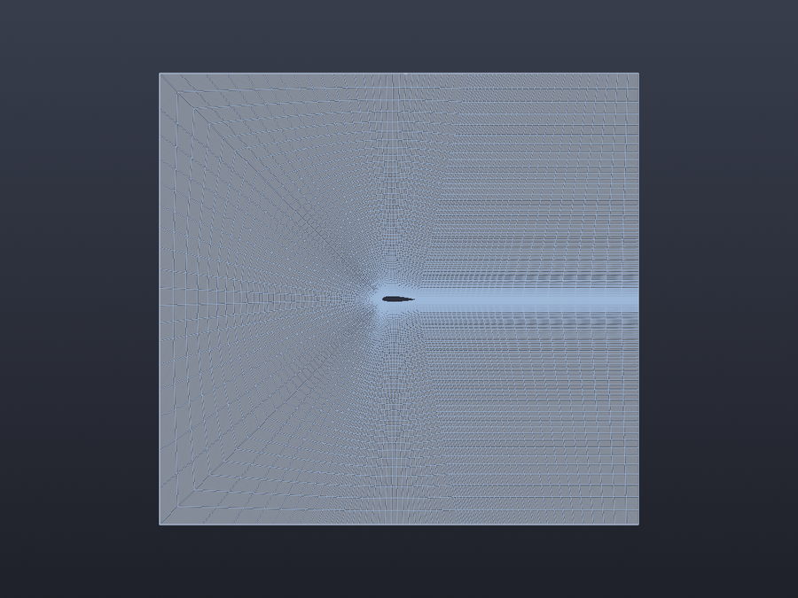
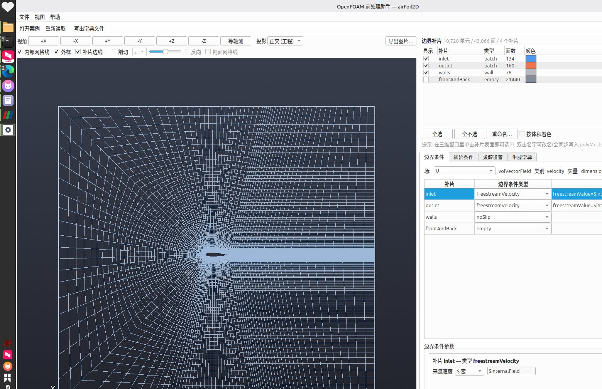
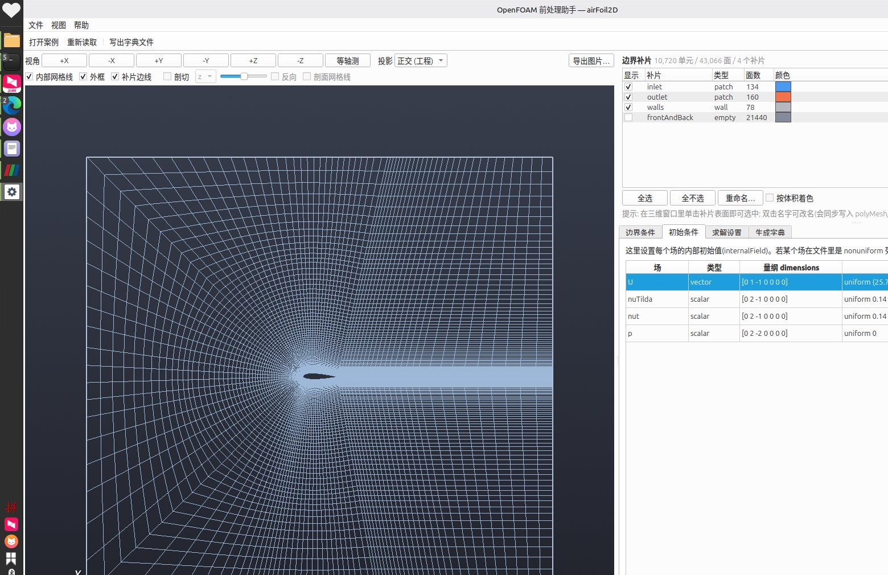
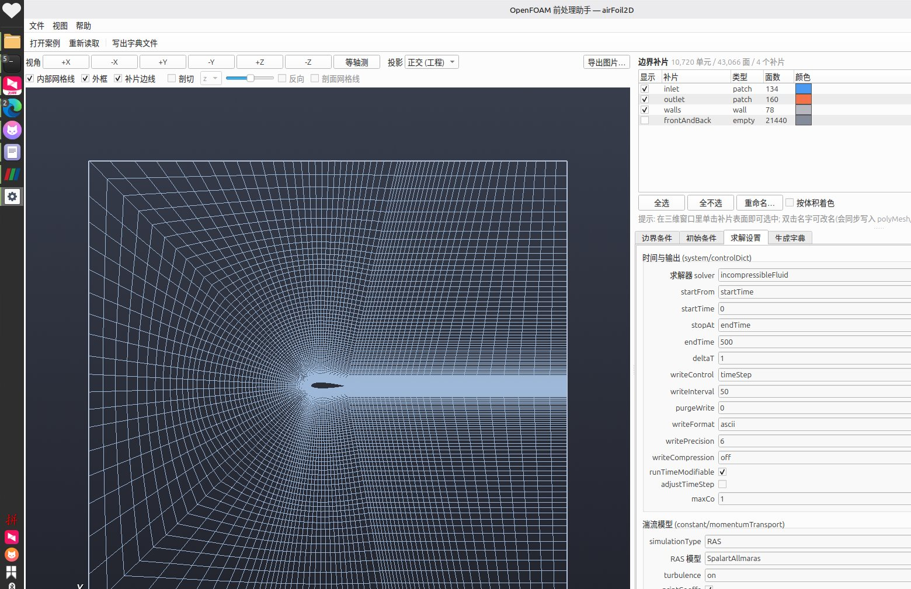
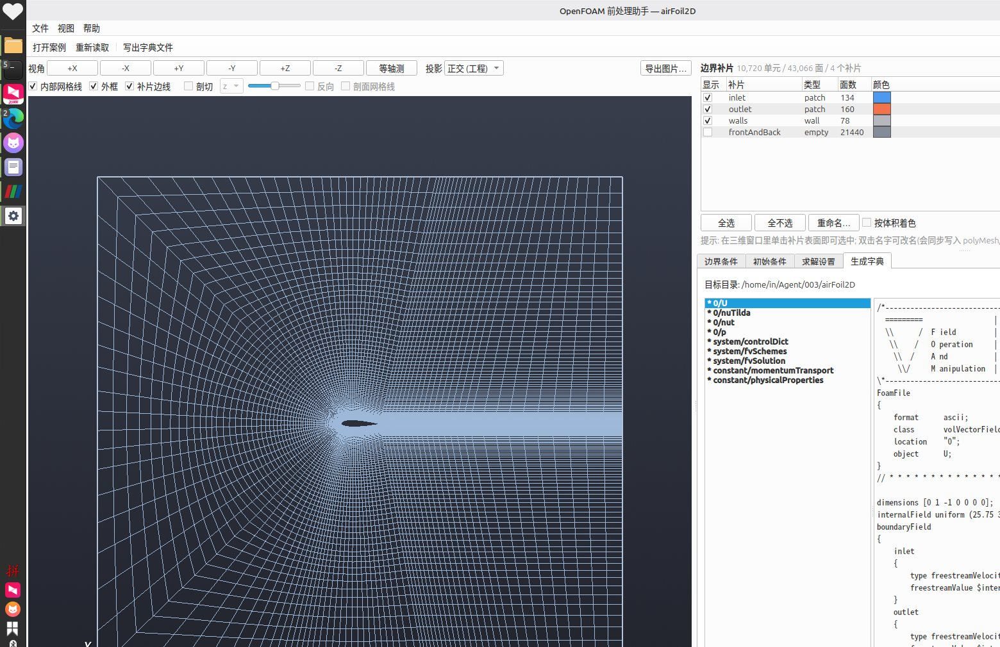

# OpenFOAM 前处理助手 (foamgui)

一个用 **PyQt6 + VTK** 写的 OpenFOAM 前处理图形界面，主要做三件事：

1. **读网格**：直接解析 `constant/polyMesh`（ASCII / binary 都支持），在三维窗口里显示网格；
2. **设条件**：按"场 + 补片"设置初始条件与边界条件，另外还能改求解器、湍流模型、物性、离散格式、线性求解器；
3. **出字典**：预览并生成 `0/`、`system/`、`constant/` 下的 OpenFOAM 字典文件（写盘前自动备份）。

当前版本针对 OpenFOAM 13 的 `airFoil2D` 案例做过完整适配与验证：
**用本工具生成的字典，可以直接 `foamRun` 正常求解**（见文末"验证"一节）。



---

## 1. 运行环境

| 依赖 | 版本 | 说明 |
| --- | --- | --- |
| Python | 3.10+ | 已在 3.12 上测试 |
| PyQt6 | 6.x | 界面 |
| VTK | 9.x | 三维显示（`vtkmodules`，含 Qt 集成） |
| numpy | 1.24+ | 网格解析与几何计算 |
| OpenFOAM | 13（可选） | 仅"校验字典""跑算例"时需要，用于对比 |

本机已有虚拟环境 `~/python/.venv`，里面已经装好上述 Python 包（PyQt6 6.11 / VTK 9.7 / numpy 2.5）。

## 2. 启动

```bash
cd /home/in/Agent/003
./run_foamgui.sh                 # 默认用 ~/python/.venv/bin/python
./run_foamgui.sh airFoil2D       # 启动并直接打开某个案例
# 或者
source ~/python/.venv/bin/activate && python -m foamgui
```

启动脚本会自动做 4 件事：选 venv 解释器、检查 PyQt6/VTK、**修复 Qt 的 xcb 平台插件依赖**、
source OpenFOAM 的 `etc/bashrc`（这样界面里的 `foamDictionary` 校验等功能可直接用）。

### 2.1 Qt 环境问题（本机最容易踩的两个坑）

**坑 1：`Could not load the Qt platform plugin "xcb"`**

Qt 6.5 起 xcb 插件需要 `libxcb-cursor.so.0`，而 Linux Mint / Ubuntu 默认不装它。
本项目已经内置兜底：

* `run_foamgui.sh` 会把项目自带的 `vendor/lib` 加进库搜索路径；
* 直接 `python -m foamgui` 时，`foamgui/qtfix.py` 会在导入 PyQt6 之前用 `ctypes` 预加载它。

**坑 2：`ImportError: /usr/lib/x86_64-linux-gnu/libQt6DBus.so.6: undefined symbol: ... version Qt_6_PRIVATE_API`**

这是**系统 Qt6 与 PyQt6 自带的 Qt6 混用**导致的。本机之所以必然触发，是因为
`~/.bashrc` 里 `source .../OpenFOAM-13/etc/bashrc` 会把 `/usr/lib/x86_64-linux-gnu`
塞进 `LD_LIBRARY_PATH`，而 `LD_LIBRARY_PATH` 的优先级高于 PyQt6 自带的 RPATH，
于是系统那套 Qt 6.4.2 盖住了 PyQt6 自带的 Qt 6.11。

项目的处理方式：

* `run_foamgui.sh`：在 source 完 OpenFOAM 之后，把 `LD_LIBRARY_PATH` 里**含
  `libQt6Core.so.6` 的目录全部剔除**（这些目录在 `ld.so.cache` 里本来就能命中，
  剔掉不影响别的库），再把 PyQt6 自带的 Qt6 目录放到最前面；
* `foamgui/qtfix.py`：直接 `python -m foamgui` 时若发现同样的污染，会**带着干净的
  环境自动重新 exec 自己**（用 `FOAMGUI_QT_ENV_FIXED` 防止递归），所以两种启动方式都能用。

**可选的永久修复**（装完 `libxcb-cursor0` 后可以删掉 `vendor/`）：

```bash
sudo apt install -y libxcb-cursor0
rm -rf vendor/
```

> 坑 2 也可以从根上避免：把 `~/.bashrc` 里 source OpenFOAM 的那行改成只在使用
> OpenFOAM 命令时再加载（例如做成 `alias ofenv='source .../etc/bashrc'`），
> 这样终端里就不会常驻 OpenFOAM 的 `LD_LIBRARY_PATH`。

## 3. 界面说明

界面按"前处理流程"组织，但**三维窗口始终可见**：左边是常驻的三维网格视图（上方一条控制栏），
右上角是**补片模型树**，右下角是设置页签（边界条件 / 初始条件 / 求解设置 / 生成字典）。
这样改初始条件或边界条件时，网格一直摆在眼前。



### 3.1 三维窗口（常驻左侧）

控制栏分两行：

* **视角**：`+X -X +Y -Y +Z -Z` 与 **等轴测**，一键切到标准视图（快捷键 `Ctrl+0` 等轴测、`Ctrl+1` 正视）；
* **投影**：**正交（工程）** 与 **透视** 可随时切换（快捷键 `Ctrl+P`）。正交适合看几何/对尺寸，
  透视有近大远小，看三维形体更直观；
* **显示**：内部网格线（2D 案例默认为开，看平面网格最清楚）、外框、补片边线；
* **剖切**：勾选后沿 x/y/z 剖开看内部，剖面按"所属单元的体积"着色，可反向、可叠加剖面网格线；
* **导出图片…**：把当前视图导出成 PNG。

鼠标：左键拖动旋转、中键/滚轮平移缩放（VTK 标准操作）。

### 3.2 鼠标点选补片 <-> 模型树联动

* **在三维窗口里单击某个补片表面**，右上角模型树对应行会自动选中（并自动把它显示出来），
  右下角的边界条件页也会跳到该补片；
* 反过来，在模型树或边界条件表里选中某个补片，三维窗口里对应的补片会用**粗橙边**高亮；
* 实现说明：拾取是自己做的射线-三角面求交（不是 VTK 的 picker，见 4.3 节）；
  二维案例里 `inlet/outlet/walls` 都是垂直于视线的薄带，正视图下射线打不中，
  所以还加了一层"按屏幕距离吸附最近面心"的兜底，保证二维网格也点得中。

### 3.3 补片模型树与重命名

* 每行一个补片：显示勾选框、补片名、类型、面数、颜色（点色块改色）；
* **重命名**：双击"补片"列的名字直接改，或选中后点 **重命名…**；
  改名会同时写到 `constant/polyMesh/boundary` 与**所有场**的 `boundaryField`，
  写出字典时一并更新（已用 `checkMesh` + `foamRun` 验证过改名后算例仍能正常求解）；
* **按体积着色**：用颜色表示单元体积大小，快速看网格疏密；
* 补片行上还有 全选 / 全不选。

### 3.4 边界条件


* 顶部选择**场**（`U` / `p` / `nut` / `nuTilda` …）；
* 表格一行一个**补片**：补片名、边界条件类型（下拉框，按补片类型过滤）、参数摘要、补片类型；
* 下面根据所选类型动态生成**参数表单**，常见参数（`value` / `freestreamValue` / `inletValue` /
  `p0` / `uniformValue` …）都能选 `uniform`、`$ 宏` 或原样写法；
* **按补片名推荐边界条件**：根据补片名与类型自动判断，例如
  * `empty`/`wedge` 补片 → `empty`/`wedge`
  * `walls`（wall 类型）→ `U: noSlip`、`p: zeroGradient`、`nut: nutUSpaldingWallFunction`…
  * `inlet`/`outlet`/`farfield` → `U: freestreamVelocity $internalField`、
    `p: freestreamPressure $internalField`、湍流场 `freestream $internalField`
  * 名字里带 `symmetry` → `symmetry`
* **同步网格补片**：换网格后新出现的补片，一键补进所有场。

> 目录里没有列出的"冷门"边界条件参数不会被丢掉：它们会以"其他参数（原样保留）"的形式出现在表单里。

### 3.5 初始条件



* 表格列出 `0/` 目录下所有场，显示类型、`dimensions`、`internalField`；
* 选中某个场后编辑内部值：`uniform` 直接填数（矢量填 3 个分量）、`$ 宏` 写成 `$internalField`、
  `原样` 直接写 OpenFOAM 表达式；
* 原本是 `nonuniform`（逐单元给定）的场只做显示、不会被覆盖，除非你主动改；
* 可以"添加场"（常见场目录或自己输名字，如 `k`、`omega`）和"删除场"（只影响本次写出）。

### 3.6 求解设置



按文件分组，控件直接读写字典条目：

* **controlDict**：`solver`（OpenFOAM 13 用 `foamRun` + 模块名，如 `incompressibleFluid`）、
  `startFrom/startTime/stopAt/endTime/deltaT`、写出控制、`writeFormat`、自适应时间步…
* **momentumTransport**：`simulationType`（laminar/RAS/LES）、模型（`SpalartAllmaras`、`kOmegaSST`…）；
* **physicalProperties**：`viscosityModel`、`rho`、`nu`（带量纲，只改数值）；
* **fvSchemes**：`ddt/grad/laplacian/interpolation/snGrad` 的 default，以及 `divSchemes` 明细表格
  （可增删行，支持 `div(phi,U)` 这类带括号的键）；
* **fvSolution**：`solvers` 表、`SIMPLE`/`PIMPLE` 参数、`relaxationFactors`。

### 3.7 生成字典



* 左侧列出将要写出的文件，带 `*` 的表示与磁盘上现有内容不同；补片改过名时，
  `constant/polyMesh/boundary` 也会出现在列表里；
* 右侧是文件的**完整文本预览**（所见即所写）；
* 三个按钮：
  * **写入案例目录**：写盘前把原文件备份到 `foamgui_backup/<时间戳>/`；
  * **另存到新目录**：整套字典写到新目录（不动原案例）；
  * **用 foamDictionary 校验**：写到临时目录并逐个用 OpenFOAM 工具解析一遍。

## 4. 设计思路（为什么这样写）

### 4.1 字典："解析 → 修改 → 序列化"，而不是"从模板重新生成"

读取案例时，所有字典文件都会被解析成 `FoamDict` 树（`foamgui/foam/dictfile.py`），
GUI 只修改它关心的条目，写盘时再整棵树序列化回文本。好处是：

* 用户手写的、GUI 还不支持的任何条目（自定义函数、`#include`、冷门参数）都会**原样保留**；
* "预览"和"写出"用的是同一份文本，所见即所得；
* 因此换一个案例（哪怕网格、场、求解器都不一样）也能直接用，不需要改代码。

解析器特别处理了几个 OpenFOAM 的语法细节：块注释文件头、`1e-05` 这类数字、
`$internalField` 宏、`[0 1 -1 0 0 0 0]` 量纲、`nonuniform List<scalar> 100 (...)`，
以及 `div(phi,U)`、`div((nuEff*dev2(T(grad(U)))))` 这种**带括号的键**。

### 4.2 网格：自己解析 + 四面体分解

`foamgui/foam/polymesh.py` 用 numpy 直接解析 `polyMesh`：

* ASCII 的 `faces` 同时支持经典的 `4(1 2 3 4)` 与 OpenFOAM 13 二进制里的紧凑写法（偏移数组 + 展平标签）；
* binary 文件按"ASCII 个数 + `(` + 原始二进制 + `)`"的格式读取，标签宽度（int32/int64）自动嗅探；
* 从 `owner/neighbour` 建立"单元 → 面"和"单元 → 点"的 CSR 索引；
* 单元体积用散度定理向量化计算（已和包围盒体积、以及 OpenFOAM 自己的结果核对过）。

三维显示（`foamgui/ui/mesh_scene.py`）把每个多面体单元分解成"单元中心 + 各面三角扇"的四面体：
VTK 对四面体的剖切/取边支持最完善，而把 OpenFOAM 多面体直接建成 `VTK_CONVEX_POINT_SET`
在剖切时会崩、体积也不准（实测踩过这个坑）。补片则各自建一个 `vtkPolyData`，方便单独控制颜色与显隐。

### 4.3 补片拾取：自己做射线求交

三维窗口里的"点补片"踩了两个 VTK 的坑，最后都绕开了：

* `vtkCellPicker` 在本机（软件 OpenGL / Mesa）对补片 actor 取不到，带 pick list 时必然返回空；
* 鼠标事件挂在 VTK 交互器上也收不到 —— QVTK 的 `mouseReleaseEvent` 里那句
  `self._Iren.LeftButtonReleaseEvent()` 在本版本（VTK 9.7 + PyQt6）**不会真正派发事件**
  （手动调用同一个方法却能派发），所以 `LeftButtonReleaseEvent` 观察者永远不触发。

因此鼠标事件改为**在 Qt 层处理**（`MeshView.eventFilter`，按下/移动/抬起都走 Qt），
坐标按 QVTK 同样的规则换算（`y → height-y-1`，并乘设备像素比），
再交给 `foamgui/ui/mesh_scene.py` 里自己实现的拾取：

1. 把可见补片的面三角化后缓存（numpy，几毫秒）；
2. 由屏幕坐标反算世界坐标射线（`SetDisplayPoint` + `DisplayToWorld`）；
3. 用 Möller–Trumbore 对全部三角面做向量化求交，取最近的命中；
4. 没命中时退化为"投影到屏幕后吸附最近的面心"（12 px 内）——这一步专门为二维案例准备：
   2D 网格里 `inlet/outlet/walls` 都是垂直于视线的薄带，正视图下射线打不中。

这样既不依赖 OpenGL 后端的行为，也不受驱动/软件渲染影响；VTK 的交互样式照常收到事件，
所以旋转/平移/缩放不受影响（拖动超过 4 px 就不算点击）。

### 4.4 3D 场景与 Qt 解耦

`MeshScene` 是纯 VTK 的，不依赖 Qt；Qt 那边只是用一个 `QVTKRenderWindowInteractor` 承载它。
因此可以在无图形界面的环境下用离屏渲染出图（`foamgui/tests/render_preview.py`），
自检和出文档图片都用它。

## 5. 目录结构

```
foamgui/
├── app.py                    # QApplication 入口
├── __main__.py               # python -m foamgui
├── qtfix.py                  # Qt xcb 插件依赖(libxcb-cursor)自动兜底
├── foam/                     # 与界面无关的 OpenFOAM 数据处理
│   ├── dictfile.py           # 字典解析 / 序列化
│   ├── polymesh.py           # polyMesh 读取 + 几何计算
│   ├── fields.py             # 场目录、BC 类型目录、推荐规则、参数读写
│   ├── case.py               # 案例模型：读取 / 写出 / 备份 / 预览
│   └── ofenv.py              # 探测并调用 OpenFOAM 命令行工具
├── ui/
│   ├── main_window.py        # 主窗口、菜单、案例树
│   ├── view_panel.py         # 三维视图面板（常驻）+ 控制条
│   ├── mesh_scene.py         # 三维场景（纯 VTK：渲染/剖切/拾取）
│   ├── patch_panel.py        # 补片模型树（显隐/颜色/重命名）
│   ├── bc_tab.py             # 初始条件页 + 边界条件页
│   ├── solver_tab.py         # 求解设置页
│   ├── output_tab.py         # 生成/预览/写出字典页
│   └── widgets.py            # 通用小部件
└── tests/
    ├── test_foam.py          # 单元测试（不需要 GUI）
    ├── smoke_gui.py          # 离屏 GUI 冒烟测试（截图 + 联动 + 改名 + 试写）
    ├── interaction_gui.py    # 真实窗口交互测试（鼠标点选/拖动/投影）
    ├── render_preview.py     # 离屏渲染网格预览图
    └── e2e_openfoam.py       # 端到端：写字典 + foamRun 真跑
run_foamgui.sh                # 启动脚本(venv + Qt 依赖检查 + OpenFOAM 环境)
push_github.sh                # 推送到 GitHub(SSH over 443)
tools/push_via_api.py         # 备用推送通道(GitHub REST API, 绕开被墙的 git 端口)
vendor/lib/                   # libxcb-cursor 兜底副本(见 vendor/README.md)
docs/                         # 文档图片
```

## 6. 验证

```bash
# 1) 单元测试：字典解析/网格读取/二进制网格/BC 推荐/案例读写
python -m foamgui.tests.test_foam airFoil2D
#    -> 通过 50 项检查, 失败 0 项

# 2) 离屏 GUI 冒烟测试：打开 airFoil2D、切换每个页签、截图、试写字典
QT_QPA_PLATFORM=offscreen FOAMGUI_SKIP_VTK_WIDGET=1 python -m foamgui.tests.smoke_gui airFoil2D _scratch/gui

# 3) 真实窗口交互测试（需要图形显示）: 鼠标点击拾取 / 联动 / 拖动不误触 / 投影 / 改名后拾取
DISPLAY=:0 python -m foamgui.tests.interaction_gui airFoil2D
#    -> [OK] 交互测试通过

# 4) 离屏渲染网格图（软件 OpenGL）
LIBGL_ALWAYS_SOFTWARE=1 python -m foamgui.tests.render_preview airFoil2D _scratch

# 5) 端到端：用推荐 BC 重新生成整套字典，再用 OpenFOAM 13 真跑
python -m foamgui.tests.e2e_openfoam airFoil2D
#    -> foamDictionary 校验全部通过; foamRun 返回码 0, 生成 5/ 结果目录
```

第 5 项在 airFoil2D 上的实际输出（节选）：

```
[2] 读取完成: 场=['U', 'nuTilda', 'nut', 'p'] 补片=['inlet', 'outlet', 'walls', 'frontAndBack']
[3] 已套用推荐边界条件
[4] 写出 9 个文件, 备份目录 .../foamgui_backup/20260927-213331
[5] foamDictionary 校验: 全部通过
[6] foamRun 返回码 0, 用时 0.6s
[OK] 端到端验证通过: 生成的字典可以被 OpenFOAM 13 正常求解
```

## 7. 版本备份（GitHub）

代码已推送到 GitHub：**<https://github.com/Relax-in/foamgui>**

```bash
./push_github.sh                    # 推送到 Relax-in/foamgui
./push_github.sh <用户名> <仓库名>   # 推到别处
```

* 本机 `github.com` 的 22 端口时通时不通，脚本固定走 **SSH over 443**
  （`ssh://git@ssh.github.com:443/...`），复用你已登记在 GitHub 的 `~/.ssh/id_ed25519`；
* 若某天 git 传输完全不通，还有 REST API 备用通道（实测 `api.github.com` 一直可用，
  而 `github.com` 的网页与 git 端口会被墙）：

  ```bash
  echo 'github_pat_xxx' > ~/.foamgui_token && chmod 600 ~/.foamgui_token
  python3 tools/push_via_api.py --repo foamgui --private
  ```

  它会用 Git Data API 建仓库并上传当前 HEAD 的完整快照，全程不经过 `github.com`。

本地还有一份可克隆的裸仓库备份（含完整提交历史，已被 `.gitignore` 忽略）：

```bash
git clone .backup/foamgui.git /tmp/foamgui-check
```

## 8. 已知限制 / 下一步

* **只读网格、不生成网格**：目前不含 `blockMesh`/`snappyHexMesh` 的图形化建模，网格还是用 OpenFOAM 生成；
* **场数据不显示**：三维窗口目前只显示网格几何与单元体积，还没有把 `U/p` 的计算结果映射上去
  （下一步可以加 `foamToVTK` 或直接读 `polyMesh` 的场文件做云图）；
* **重命名是"改名字不改几何"**：网格拓扑没变，所以对求解没有影响；但如果案例里有
  `snappyHexMesh` 的 `meshQualityDict` 等按名字写死的设置，需要自己检查；
* **BC 目录是常见子集**：特殊求解器的专属边界条件没有全部收录，但可以用"其他参数（原样保留）"手工填；
* **`0.orig`**：会优先读 `controlDict` 的 `startTime`，其次读 `0/`，最后才是 `0.orig`；
* **GUI 启动的环境依赖**：见 2.1 节，Qt 6.5+ 需要 `libxcb-cursor0`，项目已带兜底副本；
* **二进制网格**已支持并测试，但只覆盖了 OpenFOAM 13 平台默认的 int32/float64 组合（标签宽度会自动嗅探）。
